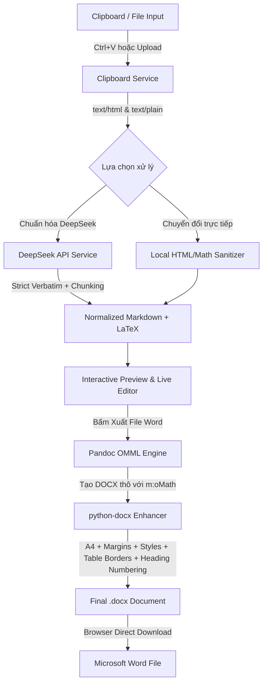

# DocxMath Studio 🚀

Ứng dụng web chạy trên Google Chrome để chuyển đổi nội dung sao chép từ **ChatGPT**, **Gemini** và **NotebookLM** thành tài liệu Microsoft Word `.docx` chuyên nghiệp với **Word Equation (OMML) chuẩn, có thể nhấp đúp và chỉnh sửa trực tiếp trong Microsoft Word**.

---

## 🌟 Tính Năng Nổi Bật

1. **Công thức toán học Word Equation (OMML) thực thụ**:
   - Sử dụng Pandoc và chuẩn OOXML để biên dịch công thức LaTeX (`$...$`, `$$...$$`, `\(...\)`, `\[...\]`) và MathML sang các phần tử toán học nguyên bản của Microsoft Word (`<m:oMath>` và `<m:oMathPara>`).
   - Hỗ trợ đầy đủ phân số (`\frac`), căn thức (`\sqrt`), tổng (`\sum`), tích phân (`\int`), ma trận (`bmatrix`, `pmatrix`, `vmatrix`), hệ phương trình nhiều dòng (`aligned`, `cases`), ký tự Hy Lạp và ký hiệu tập hợp.
   - **Tuyệt đối không sử dụng ảnh chụp công thức**. Công thức có thể bôi đen, thay đổi biến số, chỉnh sửa chỉ số trực tiếp bằng thanh công cụ Equation trong Word.

2. **Tiếp nhận dữ liệu thông minh từ Clipboard**:
   - Tự động đọc đồng thời cả `text/html` và `text/plain` từ Clipboard API khi người dùng nhấn `Ctrl+V`.
   - Bóc tách chính xác công thức từ cấu trúc HTML KaTeX/MathJax của ChatGPT, Gemini và NotebookLM mà không làm nhân đôi văn bản hay mất ký hiệu.
   - Hỗ trợ tải lên file tài liệu có sẵn (`.md`, `.txt`, `.html`).

3. **Tích hợp DeepSeek API bảo toàn nguyên văn**:
   - Nhận diện và chuẩn hóa các bài viết bị xáo trộn hoặc dán thô về cấu trúc Markdown + LaTeX chuẩn.
   - Prompt chuyên biệt tuân thủ nghiêm ngặt nguyên tắc **Bảo toàn nguyên văn (Absolute Verbatim)**: không tóm tắt, không viết lại, không bịa đặt hay làm sai lệch công thức/biến số khoa học.
   - Cơ chế phân đoạn tài liệu dài (chunking) thông minh theo ranh giới đề mục và khối nội dung, không cắt ngang công thức hay bảng biểu.
   - **Tùy chọn Chuyển đổi trực tiếp**: Người dùng có thể chuyển đổi ngay lập tức mà không cần gọi API nếu nội dung đã có Markdown/LaTeX chuẩn.

4. **Định dạng Word chuyên nghiệp (Academic Grade)**:
   - Áp dụng các Word Styles chuẩn: `Title`, `Heading 1`, `Heading 2`, `Heading 3`, `Normal`, `Blockquote`, `Source Code`.
   - Tự động đánh số thứ tự đề mục phân cấp (`1.`, `1.1.`, `1.1.1.`).
   - Đảm bảo `keep_with_next` cho các tiêu đề để không bị mồ côi (orphaned) ở cuối trang.
   - Bảng biểu được căn giữa, có viền thanh lịch, lặp lại tiêu đề bảng (`tblHeader`) trên nhiều trang và chống vỡ dòng (`cantSplit`).
   - Khối mã nguồn hiển thị font Consolas với nền xám nhạt và đường viền trang trí.
   - Nhúng trực tiếp ảnh dán từ clipboard (dạng base64) và tải ảnh từ URL an toàn.
   - Tùy chỉnh khổ giấy (A4 / Letter), 4 mức lề trang, cỡ chữ, phông chữ (Times New Roman, Arial, Calibri, Segoe UI, Roboto) và độ giãn dòng.

---

## 🏗️ Kiến Trúc & Luồng Dữ Liệu



### Chi tiết từng giai đoạn:
1. **Clipboard Ingestion**: Đọc cả 2 định dạng `text/html` và `text/plain`. Trích xuất KaTeX annotation `application/x-tex`, MathML `<math alttext="...">`, và lọc bỏ các nút "Copy code" của giao diện AI.
2. **Math Normalization**: Chuẩn hóa các ký hiệu `\(...\)` thành `$..$` và `\[...\]` thành `$$..$$`. Chuyển đổi các môi trường `align*` thành `aligned` tương thích hoàn toàn với Pandoc OMML.
3. **DeepSeek Normalization (Tùy chọn)**: Dùng mô hình DeepSeek để dựng lại cấu trúc bảng biểu, danh sách và phục hồi công thức toán bị gãy cú pháp, bảo toàn 100% nội dung gốc.
4. **Pandoc OMML Generation**: Pandoc dùng bộ dịch `texmath` chuyển đổi các biểu thức LaTeX thành cây XML OMML chuẩn của Microsoft Office.
5. **Post-processing với python-docx**: Can thiệp sâu vào cấu trúc OOXML (`word/document.xml`, `word/styles.xml`), thiết lập kích thước A4, lề trang, áp font học thuật cho mọi kịch bản ngôn ngữ, vẽ viền bảng và lặp lại tiêu đề bảng qua trang mới.

---

## 📋 Yêu Cầu Hệ Thống

- **Hệ điều hành**: Windows 10/11, macOS, hoặc Linux / WSL Ubuntu.
- **Python**: Phiên bản 3.10 trở lên.
- **Node.js**: Phiên bản 18 trở lên (để chạy dev hoặc build frontend).
- **Pandoc**: Phiên bản 3.0 trở lên.

---

## 🚀 Hướng Dẫn Cài Đặt & Chạy Ứng Dụng

### Cách 1: Tự động 1-Click trên Windows (Khuyên dùng - Không cần Docker)

Trên bất kỳ máy tính Windows nào (Windows 10/11), bạn **không cần cài Docker hay WSL**:

1. **Cài đặt tự động môi trường (chỉ cần chạy 1 lần)**:
   - Nhấp đúp chuột vào file:
     ```
     cai_dat_windows.bat
     ```
   - Script sẽ **tự động kiểm tra và cài đặt**:
     - Pandoc (xử lý công thức Word Equation OMML)
     - Python 3.10+ (nếu máy chưa có)
     - Các thư viện Python cần thiết (`fastapi`, `python-docx`, `uvicorn`...)
     - Kiểm tra và biên dịch sẵn sàng giao diện người dùng.

2. **Khởi chạy ứng dụng**:
   - Nhấp đúp chuột vào file:
     ```
     run_windows.bat
     ```
   - Ứng dụng sẽ tự động khởi động và tự động mở trình duyệt web tại `http://localhost:8000`.

---

### Cách 2: Chạy bằng Docker Compose (Dành cho máy Linux/Server hoặc máy có Docker Desktop)

Nếu máy đã có sẵn Docker Desktop và WSL 2:

```bash
# 1. Khởi chạy Docker Compose
docker compose up -d --build

# 2. Mở trình duyệt Chrome truy cập:
# http://localhost:8000
```

---

### Cách 3: Chạy thủ công từng bước

1. **Cài đặt Pandoc** (nếu chưa có):
   ```powershell
   winget install JohnMacFarlane.Pandoc
   ```

2. **Cài đặt thư viện Python**:
   ```powershell
   python -m pip install -r backend\requirements.txt
   ```

3. **Biên dịch Frontend**:
   ```powershell
   cd frontend
   npm install
   npm run build
   cd ..
   ```

4. **Khởi chạy ứng dụng**:
   - Cách nhanh: Nhấp đúp vào file `run_windows.bat`.
   - Hoặc chạy qua PowerShell:
     ```powershell
     $env:PYTHONPATH = "backend"
     python -m uvicorn app.main:app --host 0.0.0.0 --port 8000 --reload
     ```
   - Mở Chrome truy cập: `http://localhost:8000`

---

### Cách 3: Chạy trên WSL Ubuntu / Linux

1. **Cài đặt Pandoc và Python**:
   ```bash
   sudo apt update
   sudo apt install -y pandoc python3 python3-pip nodejs npm
   ```

2. **Cấp quyền và chạy script**:
   ```bash
   chmod +x run_linux.sh
   ./run_linux.sh
   ```
   - Mở trình duyệt truy cập: `http://localhost:8000`

---

## 🧪 Bộ Dữ Liệu Kiểm Thử (Test Suite)

Hệ thống đã xây dựng sẵn 4 bộ dữ liệu mẫu trong thư mục `test_data/` đại diện cho các nguồn AI:

1. **Mẫu 1: Bài viết tiếng Việt & Bảng biểu** (`sample_1_vietnamese_article.md`):
   - Đề mục phân cấp `#`, `##`, `###`, trích dẫn, danh sách có thứ tự và không thứ tự, bảng Markdown so sánh độ chính xác và thời gian của các thuật toán ML.
2. **Mẫu 2: Công thức toán học phức tạp** (`sample_2_complex_math.md`):
   - Phân số (`\frac`), căn thức (`\sqrt`), giới hạn (`\lim`), tổng Euler (`\sum`), tích phân Gauss (`\int`), ma trận xoay 3D (`bmatrix`), vector (`pmatrix`), định thức (`vmatrix`), hệ 4 phương trình Maxwell (`aligned`) và hàm điều kiện (`cases`).
3. **Mẫu 3: Dữ liệu HTML chứa KaTeX/MathJax** (`sample_3_html_katex.html`):
   - Mã nguồn HTML thực tế sao chép từ ChatGPT/NotebookLM chứa thẻ `<span class="katex">`, `<div class="katex-display">`, hàm sóng $\Psi(x,t)$, phương trình Schrödinger và bảng năng lượng.
4. **Mẫu 4: Khối mã nguồn, Ảnh & Ký hiệu đặc biệt** (`sample_4_code_images.md`):
   - Code Python tính FFT, code JS kiểm tra API, ảnh base64 được nhúng trực tiếp vào docx, bảng ký tự Hy Lạp ($\alpha, \beta, \Omega$), quan hệ logic và đơn vị vật lý.

### Chạy kiểm thử tự động:

```bash
$env:PYTHONPATH = "backend"
python -m pytest backend/tests/test_samples.py -v
```

Kiểm thử xác nhận:
- Toàn bộ nội dung và thứ tự các khối được bảo toàn không mất mát.
- File DOCX chứa đầy đủ các phần tử toán học OMML (`m:oMath`, `m:oMathPara`, `m:f`, `m:rad`, `m:nary`, `m:m`).
- API key không bao giờ bị lộ trong giao diện, mã phản hồi hay siêu dữ liệu tài liệu Word.

---

## ⚙️ Biến Môi Trường (.env)

| Biến | Mặc định | Mô tả |
| --- | --- | --- |
| `DEEPSEEK_API_KEY` | *(Trống)* | API key của DeepSeek để dùng tính năng chuẩn hóa AI. Nếu để trống, ứng dụng hoạt động hoàn hảo ở chế độ chuyển đổi cục bộ |
| `DEEPSEEK_BASE_URL` | `https://api.deepseek.com` | Base URL của dịch vụ DeepSeek API |
| `DEEPSEEK_MODEL` | `deepseek-chat` | Mô hình ngôn ngữ DeepSeek sử dụng |
| `PANDOC_PATH` | *(Tự phát hiện)* | Đường dẫn file nhị phân Pandoc nếu không nằm trong PATH hệ thống |

---

## 📄 Bản Quyền & Giấy Phép

Phát triển bởi đội ngũ công nghệ vì cộng đồng học thuật và nghiên cứu khoa học. Sử dụng mã nguồn mở MIT License.
